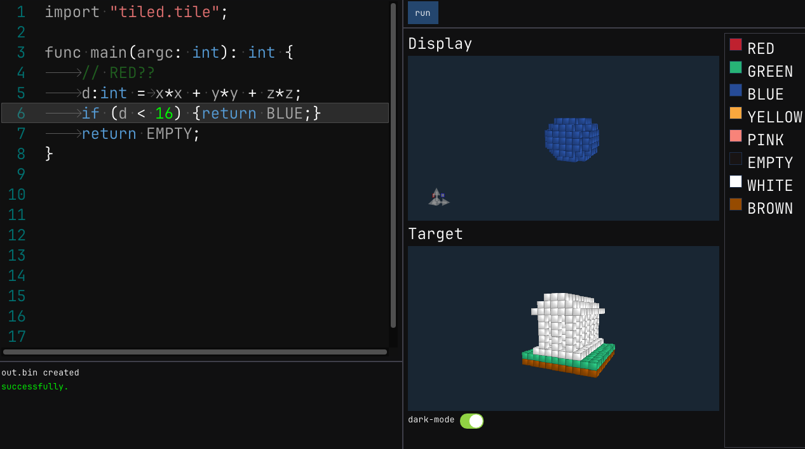

# tiledgame

this is a clone of the game [Replicube](https://store.steampowered.com/app/3401490/Replicube/)
it is written in C++.
And we have used in the game our own programming language [tile](https://github.com/tile-lang/) instead of lua

##  screen shots

